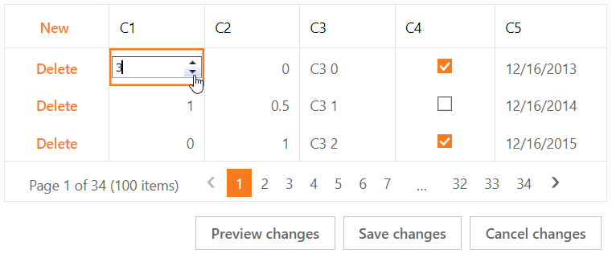

<!-- default badges list -->

[](https://supportcenter.devexpress.com/ticket/details/T115096)
[](https://docs.devexpress.com/GeneralInformation/403183)
<!-- default badges end -->
# Grid View for ASP.NET Web Forms - How to implement an edit item template in batch mode
<!-- run online -->
**[[Run Online]](https://codecentral.devexpress.com/128532952/)**
<!-- run online end -->

This example demonstrates how to create an edit item template, add an editor to the template, and configure the grid's cell edit functionality in batch mode.



## Overview

Follow the steps below:

1. Specify a column's [EditItemTemplate](https://docs.devexpress.devx/AspNet/DevExpress.Web.GridViewDataColumn.EditItemTemplate?p=netframework) property and add an editor to the template.

    ```aspx
    <dx:GridViewDataColumn FieldName="C1">
        <EditItemTemplate>
            <dx:ASPxSpinEdit ID="C1_spinEdit" runat="server" ClientInstanceName="C1spinEdit" Width="100%" />
        </EditItemTemplate>
    </dx:GridViewDataColumn>
    ```

2. Handle the grid's client-side [BatchEditStartEditing](https://docs.devexpress.devx/AspNet/js-ASPxClientGridView.BatchEditStartEditing) event and do the following in the handler:

   * Use the [rowValues](https://docs.devexpress.devx/AspNet/js-ASPxClientGridViewBatchEditStartEditingEventArgs.rowValues) argument property to get the value of the processed cell.
   * Call the editor's `SetValue` method to assign the cell value to the editor.
   * Focus the editor.

    ```js
    function Grid_BatchEditStartEditing(s, e) {
        var templateColumn = s.GetColumnByField("C1");
        if (!e.rowValues.hasOwnProperty(templateColumn.index))
            return;
        var cellInfo = e.rowValues[templateColumn.index];
        C1spinEdit.SetValue(cellInfo.value);
        if (e.focusedColumn === templateColumn)
            C1spinEdit.Focus();
    }
    ```

3. Handle the grid's client-side [BatchEditEndEditing](https://docs.devexpress.devx/AspNet/js-ASPxClientGridView.BatchEditEndEditing) event. In the handler, get the editor's value and use the [rowValues](https://docs.devexpress.devx/AspNet/js-ASPxClientGridViewBatchEditEndEditingEventArgs.rowValues) argument property to assign this value to the processed cell.

    ```js
    function Grid_BatchEditEndEditing(s, e) {
        var templateColumn = s.GetColumnByField("C1");
        if (!e.rowValues.hasOwnProperty(templateColumn.index))
            return;
        var cellInfo = e.rowValues[templateColumn.index];
        cellInfo.value = C1spinEdit.GetValue();
        cellInfo.text = C1spinEdit.GetText();
        C1spinEdit.SetValue(null);
    }
    ```

4. Handle the grid's client-side [BatchEditRowValidating](https://docs.devexpress.devx/AspNet/js-ASPxClientGridView.BatchEditRowValidating) event. In the handler, use the [validationInfo](https://docs.devexpress.devx/AspNet/js-ASPxClientGridViewBatchEditRowValidatingEventArgs.validationInfo) argument property to define whether the entered data is valid and specify an error text string for invalid data cells.

    ```js
    function Grid_BatchEditRowValidating(s, e) {
        var templateColumn = s.GetColumnByField("C1");
        var cellValidationInfo = e.validationInfo[templateColumn.index];
        if (!cellValidationInfo) return;
        var value = cellValidationInfo.value;
        if (!ASPxClientUtils.IsExists(value) || ASPxClientUtils.Trim(value) === "") {
            cellValidationInfo.isValid = false;
            cellValidationInfo.errorText = "C1 is required";
        }
    }
    ```

5. Handle the editor's client-side `KeyDown` and `LostFocus` events to emulate the editor behavior when a user presses a key or clicks outside the editor.

> **Note**  
> When you implement an edit item template, the control does not update the data source automatically. Handle the grid's server-side [RowUpdating](https://docs.devexpress.devx/AspNet/DevExpress.Web.ASPxGridView.RowUpdating), [RowInserting](https://docs.devexpress.devx/AspNet/DevExpress.Web.ASPxGridView.RowInserting), and [RowDeleting](https://docs.devexpress.devx/AspNet/DevExpress.Web.ASPxGridView.RowDeleting) events to update the data source manually.


## Files to Review

* [Default.aspx](./CS/Default.aspx) (VB: [Default.aspx](./VB/Default.aspx))
* [Default.aspx.cs](./CS/Default.aspx.cs) (VB: [Default.aspx.vb](./VB/Default.aspx.vb))

## Documentation

* [Grid in Batch Edit Mode](https://docs.devexpress.com/AspNet/16443/components/grid-view/concepts/edit-data/batch-edit-mode)
* [Grid View Templates](https://docs.devexpress.com/AspNet/3718/components/grid-view/concepts/templates)
* [EditItemTemplate](https://docs.devexpress.devx/AspNet/DevExpress.Web.GridViewDataColumn.EditItemTemplate)

## More Examples

* [Grid View for ASP.NET MVC - How to implement an edit item template in batch mode](https://github.com/DevExpress-Examples/gridview-batch-editing-a-simple-implementation-of-an-edititem-template-t115130)
